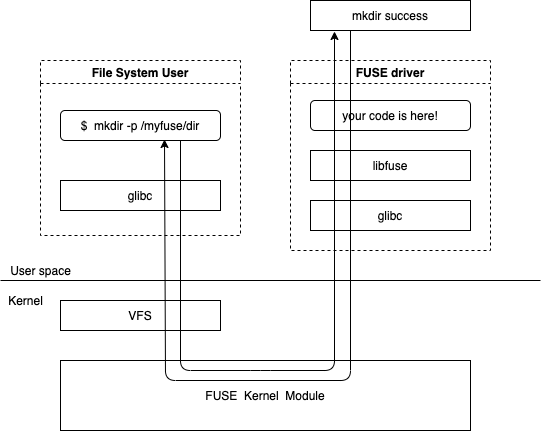

# myfuse

基于 FUSE 简单实现的文件系统工具

## 什么是 FUSE (Filesystem in Userspace)

[Linux内核官方文档](https://www.kernel.org/doc/html/latest/filesystems/fuse.html)对 FUSE 的解释如下：
> What is FUSE? FUSE is a userspace filesystem framework. It consists of a kernel module (fuse.ko), a userspace library (libfuse.*) and a mount utility (fusermount).

简单来说：FUSE 是一个用来实现用户态文件系统的框架

## FUSE 原理



## myfuse 实现的功能


* 实现客户端内容远程备份功能
* 在服务端不可达情况下不会影响到客户端文件安全
* 客户端出错情况下不会影响到客户端文件安全
* 挂载目录和数据存储目录分离
* 服务重新建立连接保证数据一致(未实现)
* 仅支持 Darwin、Linux

## 使用

server
```shell
$ ./myfuse server --port=10000 /sync_dir
```

client
```shell
$ ./myfuse client --data_path={data_path} --addr={server_host:port} /mount_dir 
```
client 启动后，在`/mount_dir` 对文件、目录进行操作都会自动同步到server端`/sync_dir/{client_id}/` 目录下

